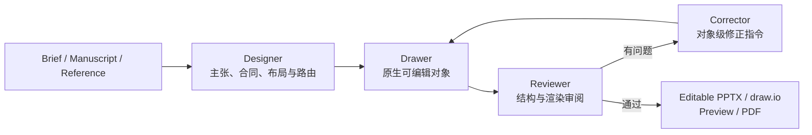

# You-Only-Figure-Once

> 将研究简述、论文稿件或参考图，转换为可编辑、可审阅、面向发表的科学插图。

**You-Only-Figure-Once（YOFO）** 是一个 Codex 插件，面向科研工作流中的结构图、机制图、方法总览、图形摘要和多面板示意图。它把设计、绘制、审阅和纠错拆成明确角色，并通过 draw.io、Microsoft PowerPoint 或 WPS Presentation 生成可继续编辑的交付物。

维护者：**gatina**

[English summary](#english-summary) · [安装](#安装) · [使用示例](#使用示例) · [开发与测试](#开发与测试)

## 为什么是 YOFO

很多科研作图流程只优化“看起来像”，却没有同时保证科学关系、最终版面可读性和对象级可编辑性。YOFO 将这些要求放入同一条闭环：

- 从 brief、manuscript 或 reference figure 中提取图的核心主张；
- 在绘制前冻结节点、边、公式操作数和证据来源；
- 用原生文字、形状、连接线、表格和图表优先构建；
- 在局部区域和整图两个层级反复渲染、审阅和修正；
- 交付可编辑的 `.pptx` 或 `.drawio`，并按需导出预览图或 PDF。

## 工作流



### 四个角色

| 角色 | 主要职责 | 关键产物 |
| --- | --- | --- |
| Designer | 定义 Figure Claim、信息层级、节点/边合同、版面和连接线路由 | 后端无关的设计规范 |
| Drawer | 在选定应用中逐区域创建原生对象 | 可编辑图形 |
| Reviewer | 同时检查科学语义、视觉层级、文字适配、连接线和栅格原子性 | 可复核的问题清单 |
| Corrector | 把问题转换为最小、可执行的对象级修正 | 有序修正操作与回归检查 |

## 核心能力

- **稿件到图形**：提取 Figure Claim、Paper Figure Signature、节点/边账本、公式操作数和证据来源。
- **参考图复刻**：按面板重建结构，优先保留文字、形状、表格、图表和连接线的可编辑性。
- **出版尺度审阅**：先确定目标栏宽或版面槽位，再检查最终缩放后的文字、箭头和正负关系。
- **连接线质量门禁**：检查端点、箭头、交叉、遮挡、起止间距以及正向/抑制关系的可辨识度。
- **栅格最小化**：仅允许不可再分解的原子图像区域，并记录来源、裁剪和保留原因。
- **后台安全绘制**：Windows PowerPoint COM 后端按逻辑区域批量执行，默认不抢占前台窗口。
- **结构与渲染双重验证**：对象检查不能替代真实渲染，真实渲染也不能替代结构检查。

## 支持的后端

| 目标应用 | 后端 | 工作方式 | 编辑性 |
| --- | --- | --- | --- |
| draw.io Desktop | Live graph API | 在可见画布中逐区域构建并截图复核 | 原生图元与组合对象 |
| PowerPoint on Windows | COM | 后台批量绘制、保存、导出与审计 | 原生 PPT 对象 |
| PowerPoint on macOS | Office.js | 连接任务窗格后通过 `context.sync()` 写入当前演示文稿 | 原生 Office.js 对象 |
| PowerPoint on macOS | OOXML fallback | 在隔离工作副本中生成 PPTX，再交给应用打开或刷新 | 原生 OOXML 对象 |
| WPS Presentation | OOXML working copy | 生成并刷新受管理的 PPTX 工作副本 | 原生 PPTX 对象 |

## 安装

### 前置条件

- 支持插件的 Codex 桌面应用或 Codex CLI；
- PATH 中可用的 `node` 命令；
- 根据目标后端安装 draw.io Desktop、Microsoft PowerPoint 或 WPS Presentation。

OOXML 后端还需要 Python 3 与 `python-pptx`：

```bash
python -m pip install python-pptx
```

LibreOffice 与 Poppler 仅用于部分文件后端的渲染、PDF 转换和预览，不是 Windows PowerPoint COM 绘制的必需项。macOS Office.js 本地任务窗格的证书准备需要 OpenSSL。

### 从 GitHub marketplace 安装

```bash
codex plugin marketplace add exsinger-hub/You-Only-Figure-Once --ref main
codex plugin add you-only-figure-once@you-only-figure-once
```

安装后重新打开 Codex，启用 **You-Only-Figure-Once**，并在新任务中开始测试。官方的插件结构与 marketplace 说明见 [OpenAI Plugin Packaging](https://developers.openai.com/plugins/build/plugins)。

### 更新

```bash
codex plugin marketplace upgrade you-only-figure-once
codex plugin add you-only-figure-once@you-only-figure-once
```

更新插件或 MCP 工具后，使用新任务加载最新的 skills 与工具定义。

## 使用示例

在 Codex 中启用插件后，可直接提出完整目标：

```text
根据这篇稿件设计 Figure 1。先给出图形主张、必需节点与关系，
再在 PowerPoint 中生成可编辑版本，并按最终栏宽审阅和修正。
```

```text
在 draw.io 中复刻这张方法框架图。保留所有可重建文字、形状、
表格和连接线的可编辑性，并逐区域截图检查。
```

```text
审阅当前 PowerPoint 的科学插图。检查层级、留白、文字适配、
箭头端点和灰度可读性，只返回有证据的对象级修正。
```

插件包含六个协作 skill：

- `design-scientific-figure`
- `recreate-scientific-figure`
- `recreate-scientific-figure-in-drawio`
- `edit-powerpoint-live`
- `audit-scientific-figure`
- `correct-scientific-figure`

## 常用配置

所有配置均为可选；默认值优先自动探测当前平台与应用。

| 环境变量 | 可选值或用途 |
| --- | --- |
| `YOU_ONLY_FIGURE_ONCE_PPT_HOST` | `auto`、`powerpoint`、`wps` |
| `YOU_ONLY_FIGURE_ONCE_PPT_BACKEND` | `auto`、`com`、`officejs`、`ooxml` |
| `YOU_ONLY_FIGURE_ONCE_FOCUS_POLICY` | `preserve`（默认）或 `foreground` |
| `YOU_ONLY_FIGURE_ONCE_PYTHON` | 指定 OOXML 后端使用的 Python 可执行文件 |
| `YOU_ONLY_FIGURE_ONCE_STATE_DIR` | 指定受管理演示文稿与会话状态目录 |
| `YOU_ONLY_FIGURE_ONCE_OPEN_VERIFY_TIMEOUT_MS` | 文件后端等待应用打开验证的时间 |

### macOS PowerPoint Office.js

在插件根目录中运行：

```bash
node scripts/officejs-setup.mjs status
node scripts/officejs-setup.mjs prepare
node scripts/officejs-setup.mjs sideload
```

`prepare` 只生成待审阅的 localhost 证书，不会自动修改系统信任；`sideload` 在 macOS 上复制加载项清单。信任证书并重启 PowerPoint 后，从 **Insert → My Add-ins → You-Only-Figure-Once Live** 打开任务窗格。

## 仓库结构

```text
.
├── .codex-plugin/plugin.json       # 插件清单
├── .agents/plugins/marketplace.json # Git marketplace 清单
├── .mcp.json                       # 三个本地 MCP 服务入口
├── skills/                         # Designer / Drawer / Reviewer / Corrector 工作流
├── scripts/                        # draw.io、PowerPoint、WPS 与 Office.js 桥接
├── officejs/                       # PowerPoint Office.js 任务窗格
└── tests/                          # 契约测试与 Windows COM 烟雾测试
```

## 开发与测试

运行无界面副作用的契约测试（需要 Node.js 与 PowerShell 7 的 `pwsh` 命令）：

```bash
node --test tests/focus-policy.contract.test.mjs tests/payload-layering.contract.test.mjs
```

在 Windows 上执行真实 PowerPoint COM 烟雾测试：

```powershell
pwsh -NoProfile -File tests/com-batch.smoke.ps1
```

COM 烟雾测试会创建临时演示文稿并验证批量绘制与焦点保持。为避免接管用户正在编辑的窗口，只能在没有 PowerPoint 进程运行时执行。

## 当前边界

- 公开仓库安装通过 Git marketplace 完成；尚未提交到通用 Plugins Directory。
- Office.js 实时后端要求任务窗格保持连接；未连接时应明确选择 OOXML 文件后端。
- WPS 与 OOXML 模式编辑受管理工作副本，不宣称持有活动窗口的内存级自动化连接。
- 不可再分解的医学影像、显微图等可以保留为原子栅格；可重建文字、箭头、图例或表格不能借此整体扁平化。

## English summary

You-Only-Figure-Once is a Codex plugin for turning a research brief, manuscript, or reference figure into an editable, publication-oriented scientific illustration. It uses a four-role **Designer → Drawer → Reviewer → Corrector** loop and supports draw.io, Windows PowerPoint COM, macOS PowerPoint Office.js/OOXML, and WPS Presentation.

Install from the repository marketplace:

```bash
codex plugin marketplace add exsinger-hub/You-Only-Figure-Once --ref main
codex plugin add you-only-figure-once@you-only-figure-once
```

The project prioritizes native editable objects, explicit scientific topology, final-scale legibility, and repeated structure-plus-renderer review.

## License

MIT, as declared in `.codex-plugin/plugin.json`.

---

感谢使用 [You-Only-Figure-Once](https://github.com/exsinger-hub/You-Only-Figure-Once) 插件，制作者：gatina。
