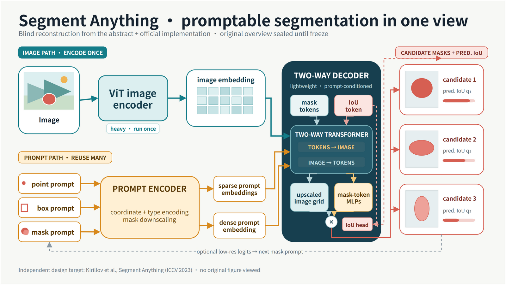
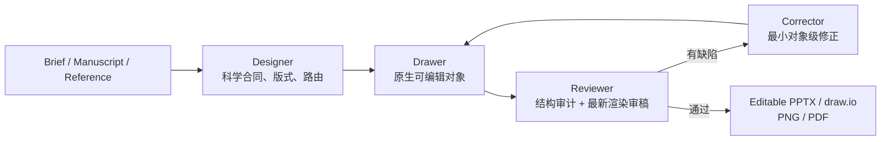

# You-Only-Figure-Once

> 把研究简述、论文稿件或参考图，转换为可编辑、可审阅、面向发表的科学插图。

**You-Only-Figure-Once（YOFO）** 是一个 Codex 科学作图插件，适用于方法 Overview、机制图、模型架构图、图形摘要和多面板示意图。它不只“生成一张看起来像论文图的图片”，而是把科学合同、版式设计、原生对象绘制、渲染审阅和对象级纠错放入同一条闭环。

维护者：**gatina**

[盲画对比](#案例盲画后再揭晓对比) · [如何画 Overview](#一张-overview-是怎么画出来的) · [知识库](#知识库用了什么) · [质量判断](#怎么判断效果是否好) · [安装](#安装) · [使用](#五分钟上手)



上图不是照着论文原图临摹的。我们选取 CCF-A 会议 ICCV 2023 的 [*Segment Anything*](https://openaccess.thecvf.com/content/ICCV2023/html/Kirillov_Segment_Anything_ICCV_2023_paper.html)，在封存其 overview、caption 和衍生图的前提下，只读摘要与官方实现，先独立画完、审完并冻结源文件，最后才揭晓官方图进行正面对比。

## 为什么需要 YOFO

科研作图常见的失败并不是“不会画圆角矩形”，而是以下要求没有同时成立：

- 图看起来完整，但漏掉了公式中的条件、逆变换、监督关系或参数冻结边界；
- 对象结构正确，但缩到论文栏宽后文字、箭头和局部证据无法阅读；
- PNG 很漂亮，但整页被扁平化，文字、连接线和面板无法继续编辑；
- 多个候选只换了颜色、字体和圆角，实际构图与阅读路径完全相同；
- 自动检查没有报错，却仍然具有拥挤、重心失衡、廉价 PPT 感等视觉问题。

YOFO 用四个角色拆开这些职责：



| 角色 | 负责什么 | 主要产物 |
| --- | --- | --- |
| Designer | 从来源中冻结科学主张、节点、关系、公式操作数、证据范围和版式系统 | `source contract`、`design spec` |
| Drawer | 在 PowerPoint、WPS 或 draw.io 中按区域创建文字、形状、线、表格、图表和原子图片 | 可编辑 `.pptx` 或 `.drawio` |
| Reviewer | 同时检查对象结构和最新渲染，不把工具调用成功当成图形正确 | 审稿记录、通过/失败结论 |
| Corrector | 将缺陷翻译成按对象、按顺序、可回归验证的修正 | 最小修改计划 |

## 案例：盲画后再揭晓对比

### 为什么选这篇论文

[*Segment Anything*](https://openaccess.thecvf.com/content/ICCV2023/html/Kirillov_Segment_Anything_ICCV_2023_paper.html) 发表于 ICCV 2023；ICCV 在 [CCF 人工智能领域推荐目录](https://www.ccf.org.cn/Academic_Evaluation/AI/)中属于 A 类会议。这个案例适合检验 Overview 能力，因为它同时包含“图像只编码一次”“多种提示”“双向特征交互”“多候选 mask 与质量预测”四层信息，既能画得极简，也能画得足够技术化。

### 实验协议：先画，后看

1. 用稳定论文 id `arXiv:2304.02643` 建立排除清单，封存论文全部图、caption、官方 `model_diagram.png` 及描述其布局的 README 段落。
2. 盲画阶段只允许读取论文摘要，以及官方实现中的 `sam.py`、`image_encoder.py`、`prompt_encoder.py`、`mask_decoder.py` 和 `transformer.py`。
3. 先冻结一句 Figure Claim、17 个必需节点、18 条必需关系、negative paths 与公式操作数，再比较两个低保真骨架。
4. 选择“上下双通道汇入中央 decoder，再向右展开候选 mask”的 **converge-and-fan** 方向；完成可编辑 draw.io、最新 PNG 和结构审计后写入 freeze receipt。
5. 只有预揭晓门禁通过后，才打开官方 overview；盲画稿不再倒改，差异另写为 post-reveal comparison。

完整过程可审阅：[source contract](examples/segment-anything-blind/source-contract.md) · [design spec](examples/segment-anything-blind/design-spec.md) · [post-reveal comparison](examples/segment-anything-blind/post-reveal-comparison.md) · [可编辑 draw.io 源文件](assets/examples/segment-anything-blind-overview.drawio)

### A. YOFO 盲画稿（揭晓前冻结）


这版把“昂贵图像编码一次、轻量提示可重复输入”做成上下双通道；中央深色模块是第一焦点，明确展示 token → image 与 image → token 的双向交换；右侧把 upscaled image embedding 与 mask-token MLPs 的乘积、三个候选 mask 及 predicted IoU 分开表达；底部虚线只表示可选的低分辨率 logits 反馈。

预揭晓审计结果：`17/17` 个必需节点和 `18/18` 条语义关系均可从图中重建；draw.io 中共有 `102` 个可编辑对象（`80` 个顶点、`22` 条原生边）、`0` 个图片对象、`0` 个硬错误、`0` 个 warning。原生边数与语义关系数不同，是因为双向交换与复合乘积关系需要拆成多条可见连接。

### B. 冻结后揭晓的官方图


官方图来自 [Segment Anything 官方仓库](https://github.com/facebookresearch/segment-anything/blob/main/assets/model_diagram.png)，以远程链接原样展示，本仓库不复制该二进制资产；仓库采用 [Apache License 2.0](https://github.com/facebookresearch/segment-anything/blob/main/LICENSE)。它用真实剪刀照片和三张有效分割结果，把 image encoder、image embedding、mask prompt 的卷积注入、points/box/text prompt encoder、mask decoder 与 score 压缩成一条 `2412 × 514` 的横向叙事。

### 正面对比

| 维度 | YOFO 盲画稿 | 官方 overview | 结论 |
| --- | --- | --- | --- |
| 第一任务 | 解释可提示分割器内部如何交换和生成信息 | 让读者立刻理解“图像 + 提示 → 多个有效 mask” | 两图优化的是不同沟通目标，不应以像素相似度判输赢 |
| 抽象层级 | 展开 sparse/dense embeddings、mask/IoU tokens、two-way attention、upscale 与 hypernetwork | 只保留 image encoder、prompt encoder、mask decoder 三个主模块 | 盲画稿更适合方法架构解读；官方图更适合论文首页快速传播 |
| 提示表达 | 跟随公开实现，画 point、box、mask，并区分稀疏与稠密路径 | points、box、text 进入 prompt encoder；mask 经 conv 后加到 image embedding | 差异来自允许证据范围，也提醒图中必须声明“论文概念范围”还是“公开代码范围” |
| 歧义输出 | 三个候选 mask 配 predicted-IoU bars，并把质量预测与 mask 生成分开 | 三张真实分割结果分别配 score | 官方结果证据更直观；盲画稿的因果归属更明确 |
| 反馈与交互 | 显式标出 low-resolution logits 的可选反馈，虚线避免误读为必经环 | 不画迭代反馈 | 盲画稿覆盖实现语义更多，官方图保持主叙事更干净 |
| 视觉策略 | `1600 × 903`、双通道汇聚、矢量符号、中央 decoder 强焦点 | 超宽单链路、真实输入/输出照片、极少文字 | 官方图在“少即是多”上更强；盲画稿在层级和可教学性上更强 |
| 可编辑性 | 文字、形状、glyph、连接线均为原生 draw.io 对象 | README 中只提供扁平 PNG | 盲画稿可以继续改标签、布局和路由；这不意味着其传播效率自动更高 |

这次对比带来的工作流改进不是“以后都画成 SAM 配色”，而是三条可迁移规则：先声明证据范围；在揭晓前冻结可审计成品；揭晓后分别判断科学语义、抽象层级、真实证据、阅读效率与可编辑性。官方图可以在极简传播上胜出，独立设计也可以在机制解释上胜出，两者都应被如实保留。

## 一张 Overview 是怎么画出来的

以下流程适用于 manuscript-driven Figure 1，而不只适用于上面的示例。

### 1. 先声明事实来源

记录稿件或 PDF 的准确版本、允许使用的图表和补充材料、目标期刊版位、最终显示宽度及交付格式。用户提供的稿件、公式和证据是科学事实来源；现有参考图可以帮助诊断，但不能擅自覆盖正文。

如果是盲测设计，还要在设计冻结前排除目标论文图及其衍生图片，防止“独立设计”退化为临摹。

### 2. 写一句 Figure Claim

Figure Claim 不是模块清单，而是读者看完必须理解的一句话。例如：

> 相邻切片经过共享 2-D 编码，中心深层特征由 Fermat 序列化与双向 Mamba 建模，A2 只修正最深层 decoder skip，而频谱目标只在训练阶段生效。

后续每个面板、箭头和强调色都应服务于这句话。

### 3. 冻结科学合同

YOFO 在选版式之前建立四类账本：

| 账本 | 必须记录 | 防止什么问题 |
| --- | --- | --- |
| Required-node ledger | 稳定 id、精确标签、类型、来源位置、条件、是否允许省略 | 模块或变量被漏画 |
| Required-edge ledger | 起点、终点、方向、关系类型、条件、可视编码 | 箭头方向错误或监督边混入推理 |
| Equation-operand ledger | 输出、全部操作数、索引/轴、共享关系、训练/推理状态 | 公式被缩成一个含糊模块名 |
| Evidence ledger | 生产者、样本/论文层级、允许主张、裁剪与原子性 | 图片位置暗示了并不存在的证据关系 |

还会记录 **negative paths**：例如训练目标不得连接到推理模块、reverse branch 必须先 flip-back 再恢复空间位置。不存在的关系同样需要验证，否则一条误连线就会改变科学含义。

在上面的 Segment Anything 盲画合同中，`17` 个必需节点和 `18` 条必需关系都已映射到设计对象，即 `17/17` 与 `18/18`。这只证明设计规范覆盖完整；最终图仍必须经过可见渲染和对象结构审稿，不能把覆盖率当作美观或成图通过证明。

### 4. 从论文版位反推画布

先确定论文中实际插入宽度，再决定画布比例、字号预算和证据预算。YOFO 不默认使用 16:9，也不会沿用另一篇论文的像素阈值。

例如，若最终以约 `0.95\textwidth` 插入：

- 设计规范要记录最终审阅宽度；
- 正文、公式和图片证据分别声明最小可读尺寸；
- 所有最终审稿都在该尺寸重做，而不是只看 PowerPoint 全屏。

### 5. 先比低保真骨架，再画成品

候选方向先做同尺寸、隐藏标题、去色的骨架比较。每个可选方向必须完成全部节点与关系映射，并在以下至少一个方面真正不同：

- 构图骨架或阅读路径；
- 第一视觉焦点；
- 方法机制与真实证据的视觉权重；
- 形状、线条或连接语法。

只有被选中的方向进入出版级绘制，避免把时间浪费在三个“换皮版本”上。

### 6. 预留连接线路由

在放对象前定义主干、skip、监督和关联关系的通道：

- 主流程尽量走少转折的正交路径；
- 平行关系保持固定间距；
- 箭头从朝向目标的一侧出发；
- 线不穿过文字、无关对象或证据图；
- training-only 和 inference 路径不能只靠颜色区分。

### 7. 分区域绘制原生对象

Drawer 按区域构建，而不是一次性生成整页位图：

1. 输入和编码区；
2. 核心机制区；
3. 解码和输出区；
4. 训练专用区；
5. 跨区域 connector lanes。

文字、形状、箭头、表格、坐标轴和图例优先保持原生可编辑。只有显微图、医学影像等不可再分解的视觉场才保留为原子栅格，并且每张图片单独裁剪、单独声明。

### 8. 每画完一个区域就审稿

每轮都收集两路证据：

- **结构证据**：对象类型、名称、边界、层级、连接端点、可编辑性和栅格声明；
- **渲染证据**：由当前目标应用重新导出的最新 PNG，而不是旧截图。

Reviewer 发现问题后，Corrector 只给出最小对象级修改，例如“将 `edge_a2_decoder` 的目标端点改到 decoder 左侧中部，并把标签上移 6 pt”，而不是“把箭头调好看一点”。修改后必须重新导出并复查同一项证据。

### 9. 在最终尺寸做整图验收

最终需要同时完成：

- 在声明的论文宽度下识别全部必需节点；
- 从可见端点、方向和路线重建全部正向关系；
- 验证所有 negative paths 没有被视觉上误连；
- 检查文字、证据、箭头和间距达到设计规范；
- 查看隐藏标题的灰度缩略图，确认第一焦点与层级仍成立；
- 对整页再做一次结构审计与出版美感审稿。

## 知识库用了什么

YOFO 插件本身**没有打包外部向量数据库，也没有默认联网 RAG**。它使用的是可读、可审阅、可版本控制的本地知识层：

| 知识层 | 内容 | 在流程中的权威性 |
| --- | --- | --- |
| 用户来源 | 稿件、公式、caption、参考图、证据素材和出版要求 | 科学事实的第一权威 |
| 角色协议 | 六个 `SKILL.md`，定义设计、复刻、绘制、审稿和纠错职责 | 规定谁在何时做什么 |
| 稿件到图规则 | [Manuscript-to-Figure Workflow](skills/design-scientific-figure/references/manuscript-to-figure-workflow.md) | 定义 Figure Claim、四类账本、来源绑定、盲测与最终尺寸验证 |
| 盲画对比协议 | [Blind Figure Gym Protocol](skills/design-scientific-figure/references/blind-figure-gym.md) | 定义目标封存、预揭晓冻结、揭晓后多维比较与规则晋升边界 |
| 出版审美规则 | [Publication Aesthetic Review](skills/audit-scientific-figure/references/publication-aesthetic-review.md) | 定义三尺度审稿、灰度层级、A/B/C 美观缺陷和最终结论 |
| 后端能力 | draw.io、PowerPoint/WPS 在运行时返回的 capability 信息 | 决定哪些对象能原生编辑、哪些需用可编辑组合对象 |

六个可调用 skill 为：

- [`design-scientific-figure`](skills/design-scientific-figure/SKILL.md)：从 brief 或稿件设计新图；
- [`recreate-scientific-figure`](skills/recreate-scientific-figure/SKILL.md)：从参考图重建；
- [`recreate-scientific-figure-in-drawio`](skills/recreate-scientific-figure-in-drawio/SKILL.md)：在可见 draw.io 画布中绘制；
- [`edit-powerpoint-live`](skills/edit-powerpoint-live/SKILL.md)：在 PowerPoint/WPS 中创建和编辑原生对象；
- [`audit-scientific-figure`](skills/audit-scientific-figure/SKILL.md)：只读审稿，不在审稿阶段偷偷修改；
- [`correct-scientific-figure`](skills/correct-scientific-figure/SKILL.md)：把 finding 转换为精确修正计划。

如果用户明确要求检索外部参考，Codex 可以另行使用获准的搜索或连接器；检索结果只是设计参考，不能自动取代稿件事实。

## 怎么判断效果是否好

“效果好”不是一个总分，也不能由“导出成功”推出。YOFO 要求三类证据同时成立。

### 1. 科学与结构正确

| 项目 | 通过条件 |
| --- | --- |
| 必需节点与关系 | 所有不可省略项 `100%` 覆盖 |
| 语义和文字准确 | `1.00` |
| 可重建编辑性 | `1.00` |
| 裁切、越界和意外重叠安全 | `1.00` |
| 几何与对齐 | `>= 0.95` |
| 连接线清晰度 | `>= 0.95` |
| 有参考图时的对应关系 | `>= 0.90` |
| 硬错误 | `0` |

硬错误包括错误文字、错误方向、箭头穿过标签或无关对象、可拆内容被整块栅格化、裁切、非原子图片以及无关连线交叉。硬错误不会被平均分抵消。

### 2. 最新渲染在三个尺度可读

| 尺度 | 看什么 |
| --- | --- |
| 缩略图 | 外轮廓、视觉重心、第一焦点、三秒阅读路径 |
| 整页 | 构图、模块比例、节奏、功能性留白、主次关系 |
| 可读尺度 | 字体、换行、局部间距、箭头端点、边框和证据细节 |

还要查看同尺寸灰度图。若去除颜色后训练/推理边界、主流程或第一焦点消失，说明层级依赖颜色，仍然不能通过。

### 3. 出版美感通过人工判断

数值门禁覆盖可测结构，不代表“顶级论文美感”。出版审稿还要求：

- 没有破坏专业性的 class-A 问题；
- 没有阻断阅读路径的 class-B 问题；
- 大块留白都能解释为层级、分组、连接通道或焦点保护；
- 主体没有为了空白或装饰而被明显缩小；
- 全图只有一个占主导地位的视觉层级；
- 图更接近论文插图，而不是工程架构图、产品宣传图或普通 PPT 示意图。

一份诚实的阶段报告应当像这样：

```text
source contract: PASS — 36/36 required nodes, 41/41 required edges mapped
editable structure: PENDING — must inspect the actual PPTX/draw.io object graph
fresh render: PENDING — must export from the selected backend at publication width
grayscale hierarchy: PENDING
publication aesthetic verdict: PENDING
final verdict: NOT YET APPROVED
```

这比只写“score 0.97”更可靠：它清楚说明已经证明了什么、还缺什么。README 中的 PNG 能展示构图和渲染观感，但只有可编辑源文件、对象审计和最新渲染一起通过，才能声称最终验收。

## 工作流怎么选

| 你的输入 | 应使用的工作流 | 关键差异 |
| --- | --- | --- |
| brief、方法描述或 manuscript | `design-scientific-figure` | 从科学合同推导全新构图 |
| PNG、JPEG、SVG、PDF 中的现有科学图 | `recreate-scientific-figure` | 以参考对应关系为约束，尽量恢复深度可编辑性 |
| 已打开的 draw.io | `recreate-scientific-figure-in-drawio` | 在可见画布中逐区域绘制、截图和复核 |
| 已打开或指定的 PPTX/WPS 文件 | `edit-powerpoint-live` | 选择 COM、Office.js 或 OOXML 后端进行原生编辑 |
| 只想审阅现有图 | `audit-scientific-figure` | 只读审稿，不自动实施修改 |
| 已有审稿 findings | `correct-scientific-figure` | 输出最小对象级纠错顺序和回归条件 |

## 支持的后端

| 目标应用 | 后端 | 工作方式 | 可编辑交付物 |
| --- | --- | --- | --- |
| draw.io Desktop | Live graph API | 在可见画布中按区域构建并截图复核 | 原生图元、连接线和组合对象 |
| PowerPoint on Windows | COM | 后台批量绘制、保存、导出和审计 | 原生 PPT 对象 |
| PowerPoint on macOS | Office.js | 任务窗格连接后通过 `context.sync()` 写入当前演示文稿 | 原生 Office.js 对象 |
| PowerPoint on macOS | OOXML fallback | 在隔离工作副本中生成 PPTX，再由应用打开或刷新 | 原生 OOXML 对象 |
| WPS Presentation | OOXML working copy | 生成并刷新受管理的 PPTX 工作副本 | 原生 PPTX 对象 |

YOFO 会先读取后端能力，再决定对象映射。设计质量门禁不会因为换了后端而降低。

## 安装

### 前置条件

- 支持插件的 Codex 桌面应用或 Codex CLI；
- PATH 中可用的 `node`；
- 根据目标后端安装 draw.io Desktop、Microsoft PowerPoint 或 WPS Presentation。

OOXML 后端还需要 Python 3 与 `python-pptx`：

```bash
python -m pip install python-pptx
```

LibreOffice 与 Poppler 只用于部分文件后端的渲染、PDF 转换和预览，不是 Windows PowerPoint COM 绘制的必需项。macOS Office.js 本地任务窗格的证书准备需要 OpenSSL。

### 从 GitHub marketplace 安装

```bash
codex plugin marketplace add exsinger-hub/You-Only-Figure-Once --ref main
codex plugin add you-only-figure-once@you-only-figure-once
```

安装后重新打开 Codex，启用 **You-Only-Figure-Once**，并在新任务中开始使用。插件结构与 marketplace 规范见 [OpenAI Plugin Packaging](https://developers.openai.com/plugins/build/plugins)。

### 更新

```bash
codex plugin marketplace upgrade you-only-figure-once
codex plugin add you-only-figure-once@you-only-figure-once
```

更新插件或 MCP 工具后，使用新任务加载最新版 skills 和工具定义。

## 五分钟上手

### 直接画一张 manuscript Overview

将稿件或 PDF 放入当前工作区，然后使用下面的提示词：

```text
使用 $design-scientific-figure，根据 Manuscript.pdf 设计 Figure 1 Overview。

目标：读者在三秒内看懂主要科学主张，再沿箭头理解完整推理路径。
版位：论文双栏通栏，按最终插入宽度审稿，不默认 16:9。
后端：Microsoft PowerPoint，交付可编辑 PPTX、PNG 预览和审稿报告。

先输出并冻结：
1. source authority 和一句 Figure Claim；
2. Paper Figure Signature；
3. required-node、required-edge、equation-operand、evidence ledgers；
4. training/inference、updated/frozen 边界和 negative paths；
5. 两个真正不同的低保真构图方向及取舍。

我选定方向后再逐区域绘制。每个区域完成后执行结构审计和最新渲染审稿；
发现问题时用 $correct-scientific-figure 给出对象级修正，再重新渲染。
最终必须在论文宽度、灰度缩略图和可读尺度同时通过。
```

### 复刻现有方法图

```text
使用 $recreate-scientific-figure，在 draw.io 中重建 reference.png。
保持全部可重建文字、形状、表格、图例和连接线可编辑；
医学影像或显微图按一个不可再分解视觉场一个图片对象处理。
逐面板绘制、审阅和修正，不要把整张图作为背景描摹。
```

### 只审阅当前 PowerPoint

```text
使用 $audit-scientific-figure 审阅当前 PowerPoint 的 Figure 1。
同时运行对象结构审计并导出最新渲染；按论文最终插入宽度检查节点、边、
negative paths、文字适配、箭头端点、灰度层级和出版美感。
只报告真实存在的缺陷，并给出最终 pass/fail，不要在审稿阶段修改文件。
```

## 常用配置

所有配置都是可选项；默认优先自动探测当前平台和应用。

| 环境变量 | 可选值或用途 |
| --- | --- |
| `YOU_ONLY_FIGURE_ONCE_PPT_HOST` | `auto`、`powerpoint`、`wps` |
| `YOU_ONLY_FIGURE_ONCE_PPT_BACKEND` | `auto`、`com`、`officejs`、`ooxml` |
| `YOU_ONLY_FIGURE_ONCE_FOCUS_POLICY` | `preserve`（默认）或 `foreground` |
| `YOU_ONLY_FIGURE_ONCE_PYTHON` | 指定 OOXML 后端使用的 Python 可执行文件 |
| `YOU_ONLY_FIGURE_ONCE_STATE_DIR` | 指定受管理演示文稿和会话状态目录 |
| `YOU_ONLY_FIGURE_ONCE_OPEN_VERIFY_TIMEOUT_MS` | 文件后端等待应用打开验证的时间 |

### macOS PowerPoint Office.js

在插件根目录运行：

```bash
node scripts/officejs-setup.mjs status
node scripts/officejs-setup.mjs prepare
node scripts/officejs-setup.mjs sideload
```

`prepare` 只生成待审阅的 localhost 证书，不会自动修改系统信任；`sideload` 在 macOS 上复制加载项清单。信任证书并重启 PowerPoint 后，从 **Insert → My Add-ins → You-Only-Figure-Once Live** 打开任务窗格。

## 仓库结构

```text
.
├── .codex-plugin/plugin.json        # 插件清单
├── .agents/plugins/marketplace.json # Git marketplace 清单
├── .mcp.json                        # 本地 MCP 服务入口
├── assets/examples/                 # README 实际渲染案例
├── examples/segment-anything-blind/ # 盲画合同、设计规范与揭晓后对比
├── skills/                          # Designer / Drawer / Reviewer / Corrector
├── scripts/                         # draw.io、PowerPoint、WPS、Office.js 桥接
├── officejs/                        # PowerPoint Office.js 任务窗格
└── tests/                           # 契约测试与 Windows COM 烟雾测试
```

## 开发与测试

运行无界面副作用的契约测试（需要 Node.js 与 PowerShell 7 的 `pwsh`）：

```bash
node --test tests/focus-policy.contract.test.mjs tests/payload-layering.contract.test.mjs
```

在 Windows 上执行真实 PowerPoint COM 烟雾测试：

```powershell
pwsh -NoProfile -File tests/com-batch.smoke.ps1
```

COM 烟雾测试会创建临时演示文稿，验证批量绘制与焦点保持。为避免接管用户正在编辑的窗口，只能在没有 PowerPoint 进程运行时执行。

## 当前边界

- 公开仓库安装通过 Git marketplace 完成；尚未提交到通用 Plugins Directory。
- Office.js 实时后端要求任务窗格保持连接；未连接时应明确选择 OOXML 文件后端。
- WPS 与 OOXML 模式编辑受管理工作副本，不宣称持有活动窗口的内存级自动化连接。
- PNG/JPEG 只能证明渲染观感，不能证明深度可编辑性；最终验收需要源文件对象审计。
- 不可再分解的医学影像、显微图等可以保留为原子栅格；可重建文字、箭头、图例、表格或规则图表不能借此整体扁平化。

## English summary

You-Only-Figure-Once is a Codex plugin for turning a research brief, manuscript, or reference figure into an editable, publication-oriented scientific illustration. It uses a **Designer → Drawer → Reviewer → Corrector** loop and supports draw.io, Windows PowerPoint COM, macOS PowerPoint Office.js/OOXML, and WPS Presentation.

The plugin uses versioned local Markdown protocols rather than a bundled external vector database. It freezes an explicit scientific contract before drawing, preserves native editable objects, and requires both object-structure evidence and a fresh renderer export at the declared publication size. Numeric checks do not replace publication-aesthetic review.

Install from the repository marketplace:

```bash
codex plugin marketplace add exsinger-hub/You-Only-Figure-Once --ref main
codex plugin add you-only-figure-once@you-only-figure-once
```

## License

MIT, as declared in `.codex-plugin/plugin.json`.

---

感谢使用 [You-Only-Figure-Once](https://github.com/exsinger-hub/You-Only-Figure-Once) 插件，制作者：gatina。
